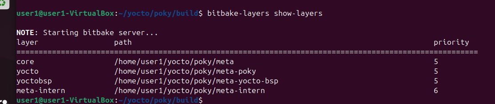
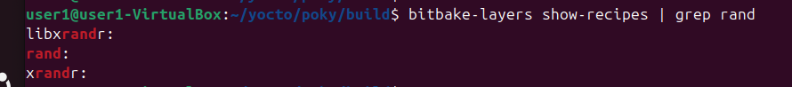
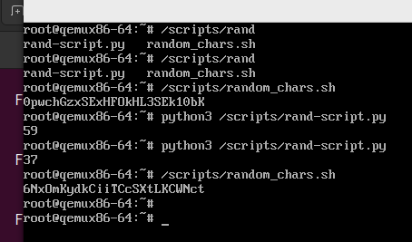

# Тестовое задание РТТ 
## Инициализируем окружение bb
- source oe-init-build-env
- Позже заменяем на allias
## Создаем новый слой и добавляем его в сборку  
- bitbake-layers create-layer ../meta-intern
- bitbake-layers add-layer ../meta-intern
 
## Создаем структуру проекта 
- poky
    - meta-intern
        - recipes-intern
            - rand.bb  #Наш bb рецепт
            - files
                - rand-script.py #Наш Python скрипт
## Пишем рецепт для bb
```
SUMMARY = "скрипт.py + скрипт.sh"
LICENSE = "CLOSED"
SRC_URI = "file://rand-script.py"     #Указываем источник скрипта для добавления в пакет

inherit allarch                 #Ставим унифицированную архитектуру, чтобы оптимизировать сборку 

RDEPENDS:${PN} += "python3"    #Указываем зависимости для python. Но в нашем случае можно указать и в конфиге

do_install() {
    install -d ${D}/scripts    #Установка директории 
    install -m 0755 ${WORKDIR}/rand-script.py ${D}/scripts/rand-script.py 

    cat > ${D}/scripts/random_chars.sh << 'EOF'  #Создаем необходимвый sh скрипт
#!/bin/sh
head -c 256 /dev/urandom | tr -dc 'A-Za-z0-9' | head -c 25
echo
EOF

    chmod 0755 ${D}/scripts/random_chars.sh
}

FILES:${PN} += "/scripts /scripts/*" #Отправка директории в пакет
```
##  Пишем Python скрипт
### коментарии излишни
```
import random 
print(random.randint(0, 100))
```
## Добавляем необходимые зависимости
### /pocky/build/conf/local.conf
```
IMAGE_INSTALL:append = " rand"      #Добавляем в образ вышеописанный пакет 
IMAGE_INSTALL:append = " bash"      #По умолчанию minimal-image использует оболочку sh
IMAGE_INSTALL:append = " coreutils" #Необходимо для работы sh скрипта т.к оказалось, 
                                    #что в minimal-image отсутствуют необходимые компоненты для 'head'
```
## Проверяем видит ли bb наш рецепт
- bitbake-layers show-recipes | grep rand
 
## Собираем наш билд 
- bitbake rand
- bitbake core-image-minimal
- Ждем следующего утра пока все соберется
## Запускаем и проверяем, что все собралось верно
- runqemu core-image-minimal
- /scripts/random_chars.sh
- python3 /scripts/rand-script.py

 